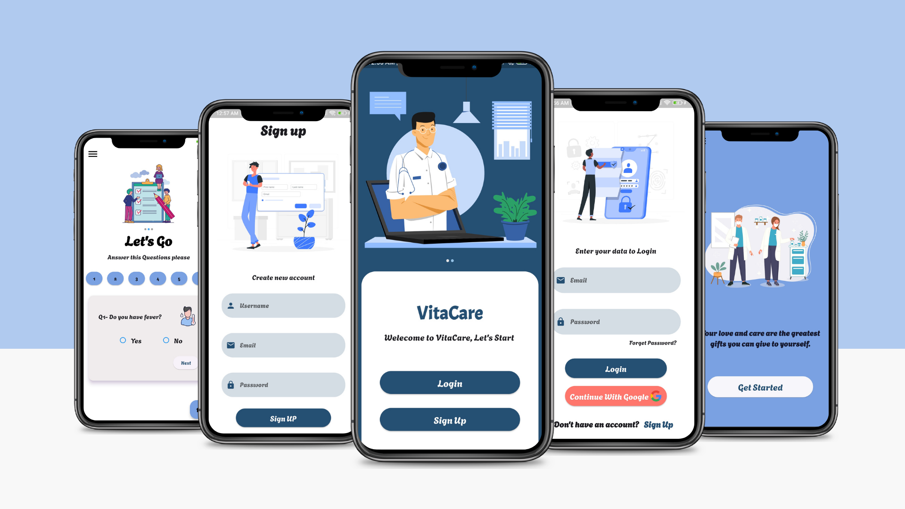
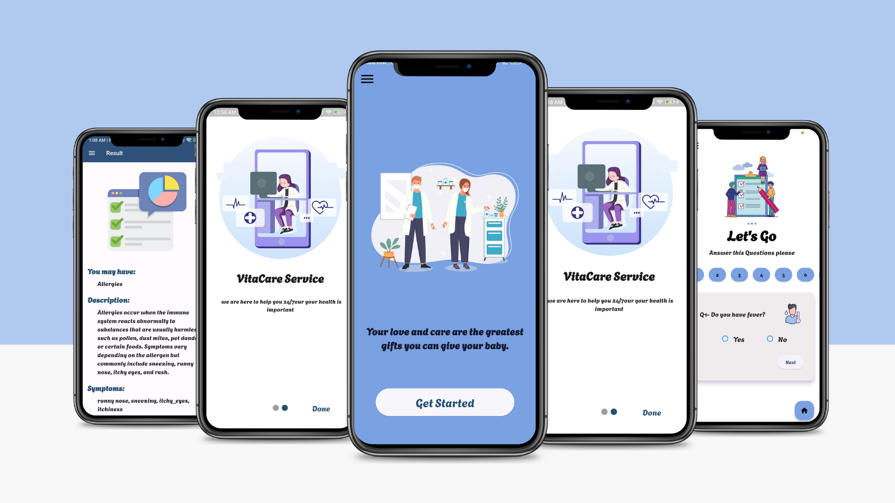

<h1 align="center">VitaCare ( General Medical Expert System )</h1>

| Image 1 | Image 2 |
|---------|---------|
|  |  |
 ### General Medical Expert system (application) the you can use to check yourself online

## Features
- **Personal Health Guide:** VitaCare acts as your personal health guide, assisting you in understanding and managing your medical conditions. It provides detailed information and advice based on your inputs.
- **Advanced Symptom Assessment:** Utilizes cutting-edge algorithms to evaluate your symptoms and deliver accurate diagnoses along with personalized treatment recommendations. This feature leverages machine learning models trained on extensive medical data.
- **User Authentication:** Register and login functionality for users.
- **Interactive Quiz:** Engaging and interactive quiz format to assess your symptoms. The quiz adapts based on your responses to gather comprehensive information for an accurate diagnosis.
- **Detailed Reports:** Generates detailed reports of your health assessments that you can review at any time. These reports can also be shared with healthcare professionals for further consultation.

## How to Use
- **Download and Install:** Ensure you have Flutter installed. Clone the repository and install dependencies.
- **Register/Login:** Create a new account or login using your existing credentials or Google account.
- **Introduction:** Optionally, read the introduction or skip it if you are already familiar with the application.
- **Start the Quiz:** Click 'Get Started' to proceed to the quiz page.
- **Answer Questions:** Respond to the questions presented (it is recommended to answer all questions for the most accurate results).
- **Navigation:** Click 'Next' to move to the subsequent question or use the question bar to go back to previous questions.
- **View Results:** Upon completion, the results will be processed and displayed on your screen.
- - **Video for the app:** [Mark Medical App (Vitacare)](https://drive.google.com/file/d/1D5n3Kly3HZrRtr1zyPlUQaLUbh6EfUXT/view?usp=drivesdk)

## Dependencies
- **Flutter:** For building the user interface.
- **Dart:** Programming language for Flutter.
- **Firebase:** For backend services including data storage and authentication.
- **Authentication:** Secure user login and registration.
- **Flutter Animation:** Enhanced UI/UX with smooth animations.
- **Python:** For implementing advanced algorithms and other backend processes.
  
## Future Work
- **Expanded Diagnoses and Treatments:** Incorporate additional medical conditions and treatment options.
- **UI Enhancements:** Implement further updates to improve the user interface.
